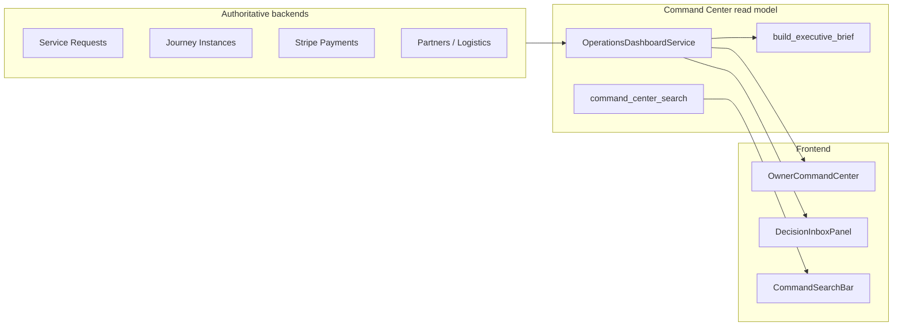
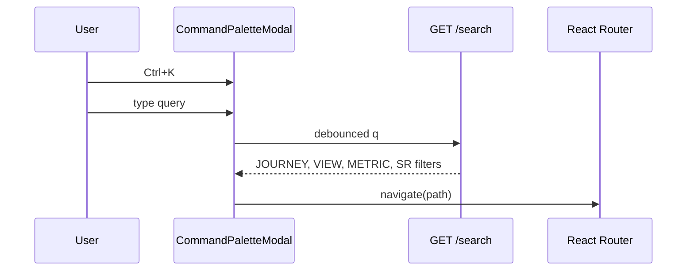

# Command Center JIT V2 — تصميم (Watchlist · Decision Journal · Palette · Since My Last Visit)

**Status:** DESIGNED (2026-10-01)  
**Scope:** Owner Command Center (`/command-center`) — قراءة + **تفضيلات مالك/مفوّض** فقط  
**Canonical API prefix:** `/api/v1/operations/command-center`  
**Related:** `docs/engineering/COMMAND_CENTER_ENGINEERING_GUIDE.md`, `docs/command-center/owner-command-center-v1.md`

---

## 1. الهدف

إغلاق فجوة **DEFERRED_JIT** بعد V1 (overview، pulse، search، decision inbox، delegations) بإضافة:

| Capability | المستخدم يحصل على |
|------------|-------------------|
| **Since My Last Visit** | ملخص «ما الذي تغيّر منذ آخر زيارة **لهذا المستخدم**» |
| **Watchlist** | تثبيت مقاييس/طلبات/تنبيهات للمتابعة اليومية |
| **Decision Journal** | سجل قرارات/ملاحظات م durable م linked للـ attention — **لا** يستبدل SR/Quote |
| **Command Palette (Ctrl+K)** | تنقل + إجراءات سريعة فوق `command_center_search` |
| **Evidence Drawer V2** (مرافق) | lineage أوضح + زر «أضف للم watchlist» |

**ثابت غير قابل للتفاوض:** `COMMAND_CENTER_BUSINESS_AUTHORITY_COUNT = 0` — لا إصدار عروض، لا تأهيل، لا JOS من CC.

---

## 2. الوضع الحالي (V1)



- **Decision Inbox:** عناصر **محسوبة** من `_attention_items()` — ليست قاعدة بيانات.
- **Executive brief:** `watch_next` / `decisions_needed` نصوص RULE_ASSISTED؛ يذكر صراحة أن Since My Last Visit غير متاح.
- **هوية CC:** `command_center_access` — owner (admin / `ADMIN_USER_ID`) أو delegate عبر `command_center_delegations`.
- **Search:** `CommandSearchBar` + `GET …/search` — deterministic؛ **ناقص** 3 رحلات (#03/#12/#16) في `JOURNEY_NAV`.

---

## 3. مبادئ التصميم

1. **Read model أولاً:** أي قيمة live (عداد طلبات، truth state) تُحلّ عند العرض من `OperationsDashboardService` أو authority المناسب — لا تخزين «قيمة رقمية» في watchlist إلا كـ cache display مع `resolved_at`.
2. **JIT persistence:** جداول CC فقط لتفضيلات المستخدم (زيارات، pins، قرارات). لا BO جديد للتجارة.
3. **Per-user, not per-tenant:** Since My Last Visit و Watchlist و Journal م keyed بـ `user_id` (owner أو delegate). المفوّض لا يرى journal المالك unless shared policy (v1: **private per user**).
4. **Audit-friendly journal:** append-only decisions؛ تعديل = `supersedes_id` + سطر جديد.
5. **Delegates & permissions:** توسيع `permissions` CSV على delegations (انظر §8).

---

## 4. نموذج البيانات (Alembic — revision واحد مقترح)

### 4.1 `command_center_visits`

| Column | Type | Notes |
|--------|------|--------|
| `id` | PK | |
| `user_id` | FK users | من JWT |
| `started_at` | timestamptz | أول overview/palette في الجلسة |
| `ended_at` | timestamptz nullable | heartbeat أو `beforeunload` beacon |
| `overview_snapshot_json` | JSON | subset ثابت (انظر §5.1) |

**Index:** `(user_id, ended_at DESC)` للبحث عن «آخر زيارة مكتملة».

### 4.2 `command_center_watchlist_items`

| Column | Type | Notes |
|--------|------|--------|
| `id` | PK | |
| `user_id` | FK | |
| `entity_type` | enum | `METRIC`, `ATTENTION`, `SERVICE_REQUEST`, `JOURNEY`, `NAV` |
| `entity_id` | string | e.g. `service_requests_total`, `sr-submitted-backlog`, `42`, `investment` |
| `label_ar` | string | snapshot للعرض |
| `navigation_path` | string nullable | |
| `sort_order` | int | default 0 |
| `created_at` | timestamptz | |

**Constraints:** unique `(user_id, entity_type, entity_id)`; **max 25** rows/user (enforce in service).

### 4.3 `command_center_decisions`

| Column | Type | Notes |
|--------|------|--------|
| `id` | PK | |
| `user_id` | FK | من أنشأ/سجّل |
| `attention_item_id` | string nullable | يطابق `AttentionItem.id` إن وُجد |
| `title_ar` | string | |
| `body_ar` | text nullable | سياق/قرار |
| `status` | enum | `OPEN`, `DECIDED`, `DEFERRED`, `SUPERSEDED` |
| `outcome_ar` | text nullable | ماذا فُعل |
| `linked_entity_type` | string nullable | `service_request`, `metric`, … |
| `linked_entity_id` | string nullable | |
| `supersedes_id` | FK self nullable | |
| `decided_at` | timestamptz nullable | |
| `created_at` | timestamptz | |

**لا** foreign key إلى SR — soft link فقط (SR قد يُحذف في dev).

---

## 5. Since My Last Visit

### 5.1 Snapshot (JSON schema v1)

يُؤخذ عند **إغلاق** الزيارة (أو كل 15 دقيقة rolling update):

```json
{
  "snapshot_version": 1,
  "captured_at": "ISO8601",
  "sr_status_counts": { "submitted": 0, "qualified": 1 },
  "attention_fingerprint": ["sr-submitted-backlog", "blocker-oidc"],
  "executive_kpis": { "service_requests_total": 12 },
  "commercial_funnel_stage": "quote_live",
  "payments_collected_count": 0
}
```

**Delta algorithm (v1):** compare keys → generate `VisitDelta[]`:

| change_type | Example |
|-------------|---------|
| `COUNT_INCREASED` | submitted +2 |
| `ATTENTION_NEW` | id appeared in fingerprint |
| `ATTENTION_CLEARED` | id removed |
| `KPI_CHANGED` | metric value changed |

### 5.2 API

| Method | Path | Behavior |
|--------|------|----------|
| `POST` | `/visits/heartbeat` | upsert open visit; optional refresh snapshot |
| `POST` | `/visits/close` | finalize `ended_at` + snapshot |
| `GET` | `/since-last-visit` | `{ last_visit_at, deltas[], has_previous_visit }` |

**Frontend:** on `OwnerCommandCenter` mount → heartbeat; on unmount / `visibilitychange` hidden → close ( `navigator.sendBeacon` optional ). Banner under hero: «منذ زيارتك الأخيرة: …».

### 5.3 Executive brief integration

Remove limitation string when implemented; append top 3 deltas to `what_changed` if `has_previous_visit`.

---

## 6. Watchlist

### 6.1 UX

- Zone جديدة في CC: **«متابعاتي»** (بجانب Decision Inbox أو تحت KPI grid).
- Pin sources:
  - `AttentionItem` row → «تثبيت»
  - Evidence Drawer → «تثبيت المؤشر»
  - SR list / recent SR row
  - Palette → «Add current view» (NAV only)

### 6.2 Resolution (server)

`GET /watchlist` returns items + **`resolved`** block:

```typescript
interface WatchlistItemResolved {
  item: WatchlistItem;
  live_label_ar?: string;
  live_value?: string | number | null;
  truth_state?: TruthState;
  severity?: AttentionSeverity; // ATTENTION type
  stale: boolean; // entity missing
}
```

Mapping:

| entity_type | Resolver |
|-------------|----------|
| `METRIC` | `METRIC_CATALOG` + live query from dashboard helpers |
| `ATTENTION` | re-run `_attention_items` and match id |
| `SERVICE_REQUEST` | SR service by id → status + reference |
| `JOURNEY` | journey metrics row |
| `NAV` | static — no resolution |

### 6.3 API

| Method | Path |
|--------|------|
| `GET` | `/watchlist` |
| `POST` | `/watchlist` body `{ entity_type, entity_id, label_ar?, navigation_path? }` |
| `DELETE` | `/watchlist/{id}` |
| `PATCH` | `/watchlist/reorder` body `{ ordered_ids: number[] }` |

---

## 7. Decision Journal

### 7.1 العلاقة مع Decision Inbox

| | Decision Inbox | Decision Journal |
|--|----------------|------------------|
| مصدر | computed | persisted |
| غرض | «ما يحتاج قراراً الآن» | «ماذا قررنا ومتى» |
| كتابة | لا | نعم (CC only) |

**Inbox actions (v1):**

- «سجّل قراراً» → modal → `POST /decisions` with `attention_item_id`
- «تأجيل» → `status=DEFERRED` + optional `decided_at`

### 7.2 API

| Method | Path |
|--------|------|
| `GET` | `/decisions?status=OPEN` |
| `GET` | `/decisions/{id}` |
| `POST` | `/decisions` |
| `PATCH` | `/decisions/{id}` — close/decide/defer (creates supersede if body changed materially) |

**Panel:** `DecisionJournalPanel` — list OPEN + recent DECIDED (7 days).

### 7.3 Business Lab / blockers

Optional `external_ref` field (v1.1): `OIDC`, `USER_VISUAL_ACCEPTANCE` — string tag on decision for traceability to register docs **without** syncing automation.

---

## 8. Command Palette (Ctrl+K)

### 8.1 Architecture



- **Library:** `@radix-ui/react-dialog` + list (or `cmdk`) — consistent with existing UI.
- **Static action registry** (frontend `commandPaletteActions.ts`):

| id | label_ar | permission | effect |
|----|----------|------------|--------|
| `nav.cc` | لوحة القيادة | read | `/command-center` |
| `nav.ops` | المراجعة المهنية | read | `/operations/service-requests` |
| `nav.readiness` | جاهزية المنصة | read | scroll `#readiness` |
| `action.evidence` | فتح دليل مؤشر… | evidence | opens drawer if metric selected |
| `action.delegations` | إدارة التفويض | delegations_manage | focus delegations panel |

- **Backend:** extend `command_center_search.py`:
  - Add journeys: `investment`, `factories_suppliers`, `delivery_warranty`
  - Add patterns: `عرض`, `قبول`, `commercial`, `partner`, `readiness`
  - Return `result_type=ACTION` for filter shortcuts (qualified SRs, pending partner)

### 8.2 Keyboard

- `Ctrl+K` / `Meta+K` — open palette (prevent when typing in input/textarea)
- `Esc` — close
- Arrow keys + Enter — select (accessibility)

`CommandSearchBar` remains as **discoverable** duplicate; palette is primary power-user path.

---

## 9. Evidence Drawer V2 (مرافق JIT)

Extend `EvidenceResponse`:

| Field | Purpose |
|-------|---------|
| `contributing_sources` | `[{ authority, table_or_service, freshness }]` |
| `period_start` / `period_end` | window for aggregates |
| `query_fingerprint` | hash of SQL/filter for support |
| `related_metric_ids` | cross-links |

UI: show lineage list; **Pin to watchlist** button (`entity_type=METRIC`).

---

## 10. الصلاحيات (delegations)

Extend allowed permission tokens:

```
read, search, executive_brief, evidence,
watchlist_read, watchlist_write,
journal_read, journal_write,
visits_write,
delegations_manage  (owner only)
```

Default delegate CSV remains backward compatible: without new tokens → watchlist/journal **denied** (403) until owner grants.

`require_command_center_permission()` used on each new route.

---

## 11. Information Architecture (OwnerCommandCenter)

Suggested section order (minimal reshuffle):

1. Hero + **Since My Last Visit** strip  
2. KPI grid + charts (existing)  
3. **Row:** Decision Inbox | **Watchlist** | Decision Journal (3 columns desktop)  
4. Attention / fulfillment (existing)  
5. Search bar **or** palette hint «Ctrl+K»  
6. Remaining panels (partners, readiness, architecture, …)

Mobile: tabs `قرارات | متابعات | سجل`.

---

## 12. خطة تنفيذ (phased)

| Phase | Deliverable | Effort | Depends |
|-------|-------------|--------|---------|
| **A** | Visits + Since My Last Visit API + banner | S | user_id stable ✓ |
| **B** | Watchlist CRUD + panel + pin from attention | M | A optional |
| **C** | Decision Journal + inbox «سجّل» | M | — |
| **D** | Command Palette + search catalog 16 journeys | S | — |
| **E** | Evidence V2 fields + pin from drawer | S | B |

**Tests per phase:**

- Backend: `test_command_center_jit.py` — auth 403, cap 25 watchlist, visit delta math
- E2E: `command-center-jit.spec.ts` — palette open, add watchlist, journal entry (admin auth from `E2E_TEST_AUTH.md`)

**Readiness register:** after Phase A shipped → `Since My Last Visit = IMPLEMENTED`; after B+C+D → clear JIT row in `EAM_REMAINING_WORK_REGISTER.md`.

---

## 13. مخاطر وMitigations

| Risk | Mitigation |
|------|------------|
| Snapshot drift if schema changes | `snapshot_version`; ignore unknown keys on compare |
| Delegate confusion (whose «last visit») | Label UI: «زيارتك» not «زيارة المنصة» |
| Journal mistaken for legal contract | Copy: «سجل داخلي للقيادة — لا يغيّر العقود» |
| Palette vs search duplication | Single search function on backend |
| Performance (watchlist N+1) | Batch resolve by entity_type |

---

## 14. Out of scope (still JIT elsewhere)

- Customer360 authority, RAG, Digital Employee, Marketplace ops  
- CC-initiated Quote/SR mutations  
- Push notifications / email digests from watchlist (Notification BO DEFERRED_JIT)  
- Shared team journal / multi-owner org (v2)

---

## 15. Acceptance criteria (definition of done)

- [ ] Owner/delegate with permission sees accurate Since My Last Visit after two sessions  
- [ ] Watchlist shows live truth states; stale pins marked  
- [ ] Journal entry links to attention id; OPEN count visible in CC  
- [ ] Ctrl+K navigates to all **16** journeys + ops filters  
- [ ] No new write endpoints outside CC preference tables  
- [ ] `test_operations_dashboard` + new JIT tests green; E2E smoke for palette  

---

**Next engineering step:** Alembic revision + `services/command_center_preferences.py` (visits, watchlist, decisions) + router submodule `routers/command_center_jit.py` included from `operations_dashboard` router.
